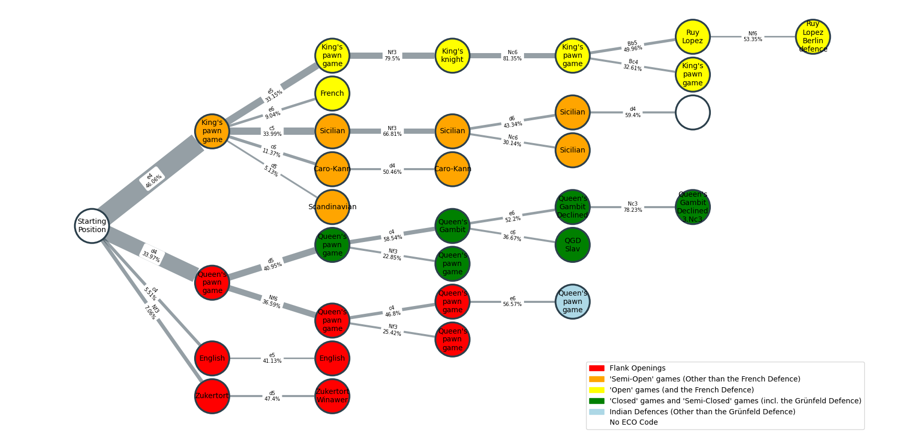

# Chess Theory Tree
### 

  

Parse a PGN database of chess matches into a tree that fits each game's opening to a tree of [ECO codes](https://www.365chess.com/eco.php). It currently shows the most popular lines and variations. 

TODO:
- [x] get some data from High elo players
- [x] learn how to use ECO codes
- [x] plot K most popular openings/ECO codes on Netgraph
- [ ] try using PyQT 
